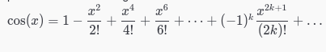

# Semana 2

Estudamos variáveis, tipos, loops e condicionais. É sempre importante praticar, então vou por mais exercícios aqui. Nesta mesma pasta está a resposta para o problema de x elevado a n. Leiam o código, e qualquer dúvida, podem me perguntar.  

- Uma loja de discos anota diariamente durante o mês de março a quantidade de discos vendidos. Determinar em que dia desse mês ocorreu a maior venda e qual foi a quantidade de discos vendida nesse dia.  
- Dado um inteiro não-negativo n, determinar n!
- Dizemos que um número natural é triangular se ele é produto de três números naturais consecutivos. Exemplo: 120 é triangular, pois 4.5.6 = 120. Dado um inteiro não-negativo n, verificar se n é triangular.
- Dados n e n seqüências de números inteiros não-nulos, cada qual seguida por um 0, calcular a soma dos números pares de cada seqüência.
- Dados n números inteiros positivos, calcular a soma dos que são primos.
- Dados x real e n natural, calcular uma aproximação para cos x através dos n primeiros termos da seguinte série:  

